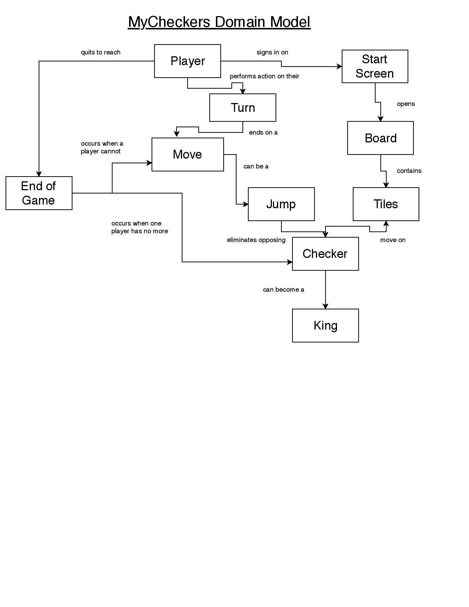

# WebCheckers Design Documentation

## Team Information
* Team name: A Team
* Team members
  * Alan Chen
  * Alec Jackson
  * Ash Nguyen
  * Nicholas Curl

## Executive Summary
WebCheckers allow users to play a game of American checkers against other users.

### Purpose
The project follows the rules of American checkers. Players should be able to play 
a game until someone wins/loses.

### Glossary and Acronyms
| Term | Definition |
|------|------------|
| VO | Value Object |
| MVP | Minimum Value Product|

## Requirements
This section describes the features of the application.

Players are able to create and sign in with an unique username. After they are signed in, they 
will be able to challenge other signed-in players to a match. When players
are in a match, they will be able to move the pieces by drag-and-drop, and also receive 
assistance through the help menu if they are confused.
### Definition of MVP
Our MVP is when users are able to sign in, start a game, and are able to play a game of checkers based on 
the American Checkers rules. Obviously, this involves all types of movement and crowning pieces.

### MVP Features
* Sign in
* Sign out
* Start a match
* Crowning
* Single move
* Single move jump
* Multiple jump move
* Required move
* All direction move
* Resignation

## Enhancements
* Spectator mode
* Replay mode

## Application Domain
This section describes the application domain.

* Player signs in on the home page.
* Player can join a match with other signed in players.
* The two players play a match of American checkers until one side loses/wins.
* The players make moves by moving the pieces.
* There are different types of moves that can be made, and a player can lose by having no moves/pieces left, or 
when he/she resigns from the match.
* Logged in users can spectate a match that is going on
* Players who have completed a match can use Replay mode to view their match again.

## Architecture and Design
This section describes the application architecture.

### Summary
The following Tiers/Layers model shows a high-level view of the webapp's architecture.

As a web application, the user interacts with the system using a
browser.  The client-side of the UI is composed of HTML pages with
some minimal CSS for styling the page.  There is also some JavaScript
that has been provided to the team by the architect.

The server-side tiers include the UI Tier that is composed of UI Controllers and Views.
Controllers are built using the Spark framework and View are built using the FreeMarker framework.  The Application and Model tiers are built using plain-old Java objects (POJOs).

Details of the components within these tiers are supplied below.

### Overview of User Interface

This section describes the web interface flow; this is how the user views and interacts
with the WebCheckers application.

### UI Tier
* First, players can get to the website by using "localhost:4567" as the link. Then, they are directed
to the home page, where they sign in. After they sign in with an unique username, their home page now lists
all of the other signed in players. Then, they are able to click on one of the other available users, which starts up a 
game. In the game, player moves are checked by the PostValidateMoveRoute. Each move they make before they submit it can 
be cancelled by the backup feature, or, if they do not wish to backup, they can simply submit their moves. After they are
finished with their game, players can then sign out. To spectate a match, simply click on an ongoing match. To replay a 
finished match, click on the replay option after finishing a match.

### Application Tier
* GameBoard displays a board with checkers pieces. The GameCenter connects the game 
board with the player lobby. The PlayerLobby is where it shows all of the signed in players.

### Model Tier
* GameView shows the game board based on the player. The pieces, player, and rows all interact with each other in 
order to make moves.

### Design Improvements
* If the project were to continue, we could add a user help menu to aid the player in making moves. Also, instead of 
having the page refresh at a set amount of time, we could refresh the page after an action is made, which makes the game
flow smoother overall.

## Testing
* Unit test classes have been made for most classes.

### Acceptance Testing
* 17 user stories have passed all of their acceptance criteria tests. No user stories
have any acceptance criteria tests failing. 

### Unit Testing and Code Coverage
* Our unit testing strategy starts from the simple, smaller classes and then make our
way up to the more complex classes. By starting with the simpler ones, we can quickly cover
a portion of the classes we need to test, which then makes testing the complex classes 
a lot easier.
