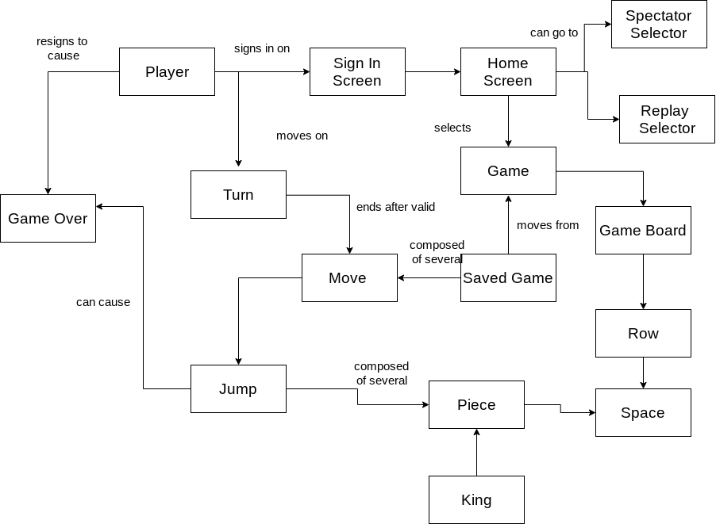

# PROJECT Design Documentation

## Team Information
* Team name: A Team
* Team members
  * Alan Chen
  * Alec Jackson
  * Ash Nguyen
  * Nicholas Curl

## Executive Summary
Webcheckers allow users to play a game of American checkers against other users.

### Purpose
The project follows the rules of American checkers. Players should be able to play 
a game until someone wins/loses.

### Glossary and Acronyms
| Term | Definition |
|------|------------|
| VO | Value Object |
| MVP | Minimum Value Object|

## Requirements

This section describes the features of the application.

Players are able to create and sign in with an unique username. After they are signed in, they 
will be able to challenge other signed-in players to a match. When players
are in a match, they will be able to move the pieces by drag-and-drop, and also receive 
assistance through the help menu if they are confused.
### Definition of MVP

Our MVP is when users are able to sign in, start a game, and are able to play a game of checkers based on 
the American Checkers rules. Obviously, this involves all types of movement and crowning pieces.

### MVP Features
> _Provide a list of top-level Epics and/or Stories of the MVP._

* Sign in
* Sign out
* Start a match
* Crowning
* Single move
* Single move jump
* Multiple jump move
* Required move
* All direction move
* Resignation

### Roadmap of Enhancements
> _Provide a list of top-level features in the order you plan to consider them._
* Replay match
* Spectator mode
* Help menu

## Application Domain

This section describes the application domain.

> _Provide a high-level overview of the domain for this application. You
> can discuss the more important domain entities and their relationship
> to each other._

* Player signs in on the home page.
* Player can join a match with other signed in players.
* The two players play a match of American checkers until one side loses/wins.
* The players make moves by moving the pieces.
* There are different types of moves that can be made, and a player can lose by having no moves/pieces left, or 
when he/she resigns from the match.

## Architecture and Design

This section describes the application architecture.

### Summary

The following Tiers/Layers model shows a high-level view of the webapp's architecture.

As a web application, the user interacts with the system using a
browser.  The client-side of the UI is composed of HTML pages with
some minimal CSS for styling the page.  There is also some JavaScript
that has been provided to the team by the architect.

The server-side tiers include the UI Tier that is composed of UI Controllers and Views.
Controllers are built using the Spark framework and View are built using the FreeMarker framework.  The Application and Model tiers are built using plain-old Java objects (POJOs).

Details of the components within these tiers are supplied below.

### Overview of User Interface

This section describes the web interface flow; this is how the user views and interacts
with the WebCheckers application.

> _Provide a summary of the application's user interface.  Describe, from
> the user's perspective, the flow of the pages in the web application._

### UI Tier
> _Provide a summary of the Server-side UI tier of your architecture.
> Describe the types of components in the tier and describe their
> responsibilities.  This should be a narrative description, i.e. it has
> a flow or "story line" that the reader can follow._

> _At appropriate places as part of this narrative provide one or more
> static models (UML class structure or object diagrams) with some
> details such as critical attributes and methods._

> _You must also provide any dynamic models, such as statechart and
> sequence diagrams, as is relevant to a particular aspect of the design
> that you are describing.  For example, in WebCheckers you might create
> a sequence diagram of the `POST /validateMove` HTTP request processing
> or you might show a statechart diagram if the Game component uses a
> state machine to manage the game._

> _If a dynamic model, such as a statechart describes a feature that is
> not mostly in this tier and cuts across multiple tiers, you can
> consider placing the narrative description of that feature in a
> separate section for describing significant features. Place this after
> you describe the design of the three tiers._

* First, players can get to the website by using "localhost:4567" as the link. Then, they are directed
to the home page, where they sign in. After they sign in with an unique username, their home page now lists
all of the other signed in players. Then, they are able to click on one of the other available users, which starts up a 
game. In the game, player moves are checked by the PostValidateMoveRoute. Each move they make before they submit it can 
be cancelled by the backup feature, or, if they do not wish to backup, they can simply submit their moves. After they are
finished with their game, players can then sign out. 

### Application Tier
> _Provide a summary of the Application tier of your architecture. This
> section will follow the same instructions that are given for the UI
> Tier above._

* GameBoard displays a board with checkers pieces. The GameCenter connects the game 
board with the player lobby. The PlayerLobby is where it shows all of the signed in players.

### Model Tier
> _Provide a summary of the Application tier of your architecture. This
> section will follow the same instructions that are given for the UI
> Tier above._

* GameView shows the game board based on the player. The pieces, player, and rows all interact with each other in 
order to make moves.

### Design Improvements
> _Discuss design improvements that you would make if the project were
> to continue. These improvement should be based on your direct
> analysis of where there are problems in the code base which could be
> addressed with design changes, and describe those suggested design
> improvements. After completion of the Code metrics exercise, you
> will also discuss the resulting metric measurements.  Indicate the
> hot spots the metrics identified in your code base, and your
> suggested design improvements to address those hot spots._

* If the project were to continue, we could add a spectator mode or additional features 
in order to make the gameplay smoother.

## Testing
> _This section will provide information about the testing performed
> and the results of the testing._

* Unit test classes have been made for classes of different tiers. We encountered a bug 
where a move was backed up incorrectly.

### Acceptance Testing
> _Report on the number of user stories that have passed all their
> acceptance criteria tests, the number that have some acceptance
> criteria tests failing, and the number of user stories that
> have not had any testing yet. Highlight the issues found during
> acceptance testing and if there are any concerns._

* 11 user stories have passed all of their acceptance criteria tests. No user stories
have any acceptance criteria tests failing. 

### Unit Testing and Code Coverage
> _Discuss your unit testing strategy. Report on the code coverage
> achieved from unit testing of the code base. Discuss the team's
> coverage targets, why you selected those values, and how well your
> code coverage met your targets. If there are any anomalies, discuss
> those._
* Our unit testing strategy starts from the simple, smaller classes and then make our
way up to the more complex classes. By starting with the simpler ones, we can quickly cover
a portion of the classes we need to test, which then makes testing the complex classes 
a lot easier.
